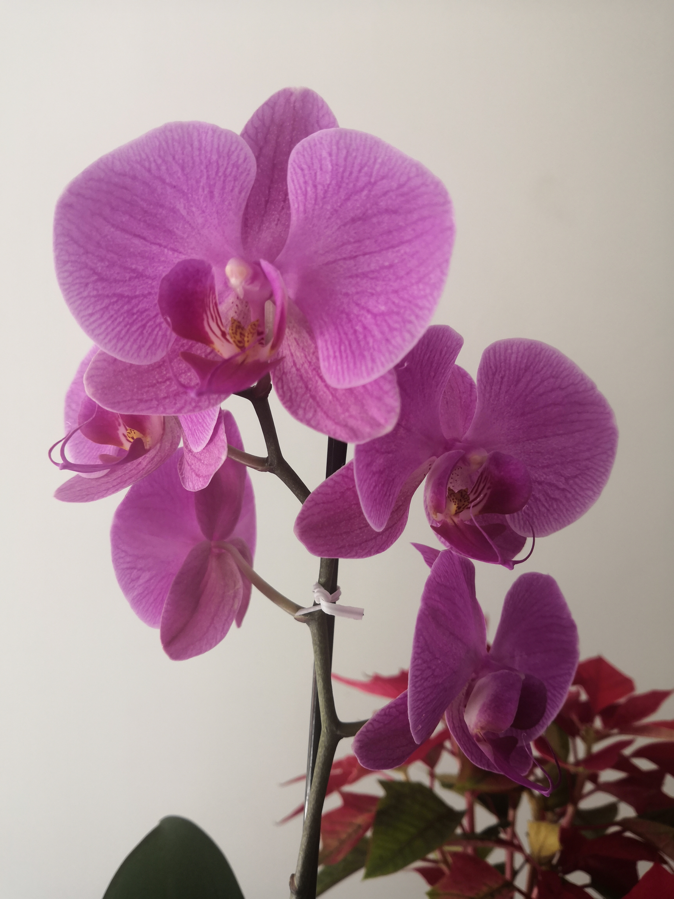

# Hi there 👋

I'm Xaraxx, I'm a web developer also really like scientific computing :computer: (like any good nerdy :stuck_out_tongue_winking_eye:)

## 💬 Ask me about ...

I have particular interest in math, physics and astronomy :sparkles: :milky_way:

I also have some knowledge about chemistry.

In my free time I used to read books I like police novels :shipit: I'm fan of Sherlock Holmes and Hercules Poirot I'm also a big fan of fantasy novels like Harry Potter.

I like to learn new languages one of my goals is been a polyglot.

## 🔭 I’m currently working on ...

Many projects, one of my favorites is about science divulgation and is in collaboration with my best friend.

I'm also collaborating in some open source projects translating the documentation into spanish, which I like a lot,  I really enjoy it!

## ⚡ Fun fact: ...

Some of my favorites sports are the swming :swimmer: and cycling :bicyclist:, I'm currently working in my styles as breast, back and I hope to learn fly that is to me the most difficult style.  

<!--
**Xaraxx/Xaraxx** is a ✨ _special_ ✨ repository because its `README.md` (this file) appears on your GitHub profile.

Here are some ideas to get you started:

- 🔭 I’m currently working on ...
- 🌱 I’m currently learning ...
- 👯 I’m looking to collaborate on ...
- 🤔 I’m looking for help with ...
- 💬 Ask me about ...
- 📫 How to reach me: ...
- 😄 Pronouns: ...
- ⚡ Fun fact: ...
-->
